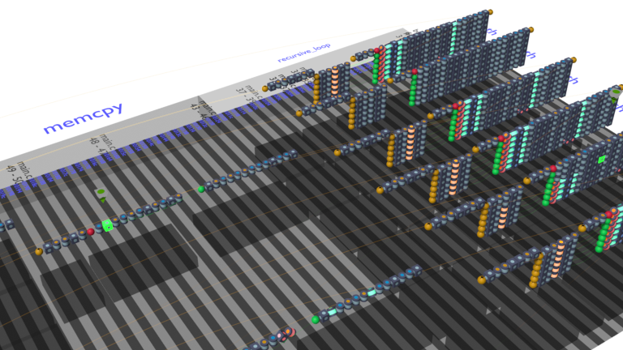

# SymEx 3D  

A [Blender][Blender org] addon for creating a 3D visualization for symbolic execution traces (generated by [this][Symex-Trace-VP] RISC-V Virtual Prototype) 

## About   

Symbolic execution is a powerful software testing
technique for finding bugs in complex software.  
Unfortunately,
following the symbolic execution and understanding its results is
challenging.  

This project tries to make symbolic execution and its results easier to understand by visualizing symbolic execution traces of RISC-V programs in 3 dimensions. 
A simulator that can generate raw trace files (.rtrace) is required. 
The [SymEx-Trace-VP][Symex-Trace-VP] was implemented on top of the existing [SymEx-VP][SymEx-Vp doi] to generate compatible raw trace files.  

The trace visualization tool consists of two parts:
- The Python module for processing and analyzing the raw trace files
- The Blender addon for importing and visualizing the processed trace files and optional CFB files

## Installation  

### Raw Trace Processing Python module
The module requires Python version 3.1 or newer to be installed

### Blender 3D Visualization Addon
The visualization is implemented as an addon for Blender and is compatible with versions 2.9.2 - 3.2.1 (and likely future versions)  

Blender is available [here][Blender org].  

Installing the addon follows the standard [Blender addon install procedure][Blender addons]: 
1. First, compress the 'visualization' directory and its contents (located in '/symex-3d/py') into a .zip archive. 
2. Inside Blender navigate to `Edit`-> `Preferences` -> `Add-ons`
3. Use the `Install` button and use the File Browser to select the `.zip` addon file. This installs the addon. 
4. Enable the add-on by checking the enable checkbox.

## Usage  

### Raw Trace Processing Python module
To create the processed (.ptrace) files from the raw trace files, run the `convert_raw_trace.py` Python script located in '/symex-3d/py' with the trace file as argument. 

script usage: 
```powershell
convert_raw_trace.py [-h] --trace TRACE --output OUTPUT [--elf ELF] [--source SOURCE]
```

If you also specify the binary ELF file and the (main) source code file, 
the script generates an additional .blk file, which contains higher level control flow information. 

### Blender 3D Visualization Addon
Open the `template/visualization_template.blend` file in Blender[^1].

[^1]:The template file contains material definitions and scene settings required 
for rendering the visualization. Some materials are created procedurally by the addon if 
they don't exist. 

**[Optional]:** 
To enable the Console Output under Windows, 
select `Window`-> `Toggle System Console`  
The addon prints progress information and any problems during scene creation to this console. 

To import and visualize the processed trace file, 
inside Blender navigate to `File`-> `Import` -> `Import SymEx Trace` and select the 
.ptrace file.  
The right hand side of the import dialogue shows some settings for the visualization.  
If a .blk file with the same name is available in the same directory, it is automatically selected and used to create additional control flow blocks in the visualization.  
Selecting `Import SymEx Trace` begins the scene creation process. 


After the process is finished, it can be viewed, interacted with and rendered by using the 
standard [Blender UI][Blender UI]. 
Navigating the scene can be done using:
- Left Mouse Button to select an object
- Middle Mouse Button to Orbit the selected object
- Shift + Middle Mouse Button to Pan
- Space bar to start or pause to animation
- Numpad 0 to toggle camera view (multiple cameras are automatically setup)

By default, the `Shading` tab is setup to enable to user to change the material for any 
object in the scene (to customize the color of any component)


## Usage Examples  
### Raw Trace Processing Python module

Minimal invocation:
```powershell
python ./convert_raw_trace.py --trace ../traces/v4/example_trace.rtrace --output "../traces/v4/"
```

Including the ELF and main.c:
```powershell
python ./convert_raw_trace.py --trace ../traces/v4/example_trace.rtrace --output "../traces/v4/" --elf "../examples/trace-example/trace-example.bin" --source "../examples/trace-example/main.c"
```

This generates the `example_trace.ptrace` and `example_trace.blk` files in '../traces/v4/'

### Blender 3D Visualization Addon
Importing the generated files as described in [Usage](#blender-3d-visualization-addon-1) 
creates a scene as seen in this render:  
<div style='float: center'>
  </img>
</div>

## Acknowledgements  

This work was supported in part by the German Federal Ministry of
Education and Research (BMBF) within the project Scale4Edge under contract
no. 16ME0127 and within the project VerSys under contract no. 01IW19001
and within the project ECXL.

[Blender org]:https://www.blender.org/
[Symex-Trace-VP]:https://github.com/agra-uni-bremen/symex-trace-vp
[SymEx-Vp doi]:(https://doi.org/10.1016/j.sysarc.2022.102456)
[Blender addons]:https://docs.blender.org/manual/en/latest/editors/preferences/addons.html#installing-add-ons
[Blender UI]:https://docs.blender.org/manual/en/latest/interface/index.html